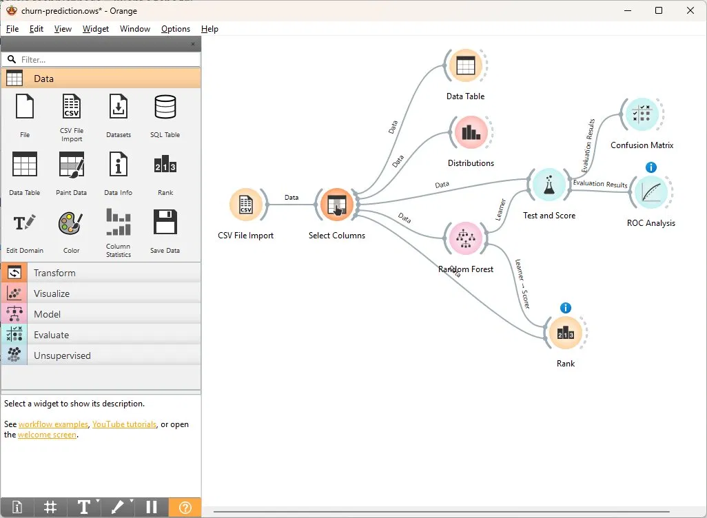
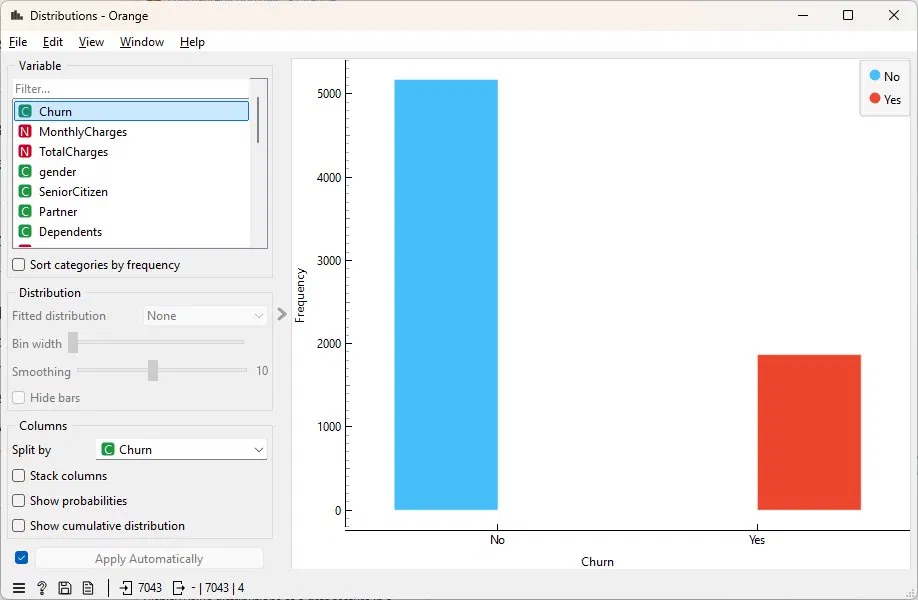
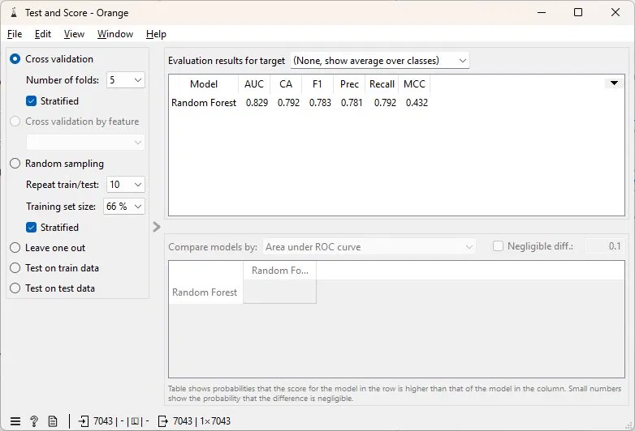
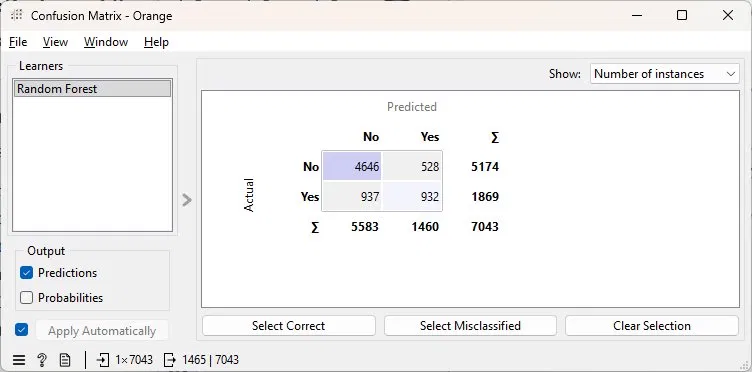
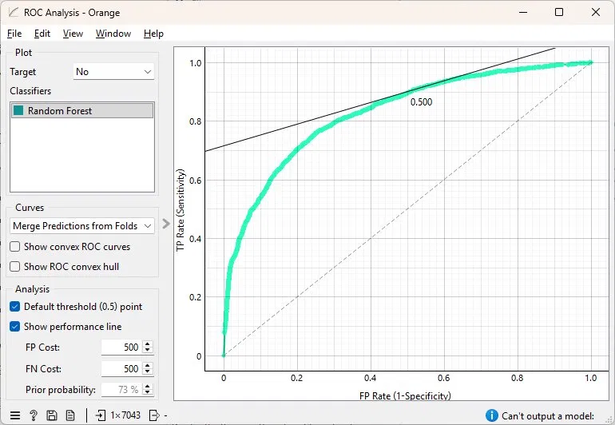
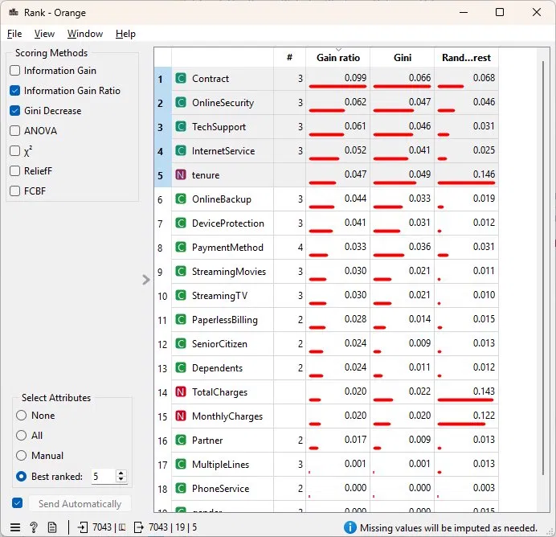

# Customer Churn Prediction — Orange Data Mining

Predictive model identifying customers at risk of churning from a telecom company,
built using Random Forest classification in Orange Data Mining.

## Tools & Technologies
- Orange Data Mining (no-code/visual ML workflow)
- Algorithm: Random Forest (100 trees, 5-fold cross validation)
- Dataset: IBM Telco Customer Churn
- Kaggle: https://www.kaggle.com/datasets/blastchar/telco-customer-churn

---

## Workflow Overview

Complete Orange workflow with 8 widgets:



---

## Dataset

- **7,043 customers**, 19 features + 1 target variable (Churn)
- Features include: contract type, internet service, tenure, monthly charges,
  online security, tech support, payment method and more
- **No missing values**

---

## Churn Distribution



| Class | Count | Percentage |
|---|---|---|
| No (stayed) | 5,174 | 73.5% |
| Yes (churned) | 1,869 | 26.5% |

Dataset is imbalanced — more customers stayed than left.
Stratified cross-validation was used to handle this.

---

## Model Performance

5-fold stratified cross-validation results:



| Metric | Score | Meaning |
|---|---|---|
| **AUC** | **0.829** | Excellent — well above 0.8 threshold |
| **CA** | **0.792** | 79.2% of customers correctly classified |
| **F1** | **0.783** | Good balance between precision and recall |
| **Precision** | **0.781** | 78% of predicted churners actually churned |
| **Recall** | **0.792** | Model catches 79% of actual churners |

---

## Confusion Matrix



| | Predicted: No | Predicted: Yes |
|---|---|---|
| **Actual: No** | 4,646 ✓ | 528 ✗ |
| **Actual: Yes** | 937 ✗ | 932 ✓ |

- **4,646** correctly identified loyal customers
- **932** correctly identified churners — model successfully flags at-risk customers
- **937** missed churners (false negatives) — biggest area for improvement
- **528** false alarms (false positives) — loyal customers incorrectly flagged

---

## ROC Curve



ROC curve sits well above the diagonal (random classifier baseline),
confirming the model has strong discriminative power with AUC = 0.829.

---

## Feature Importance



Top factors driving customer churn:

| Rank | Feature | Importance | Business Meaning |
|---|---|---|---|
| 1 | **Contract** | 0.099 | Month-to-month contracts churn most |
| 2 | **OnlineSecurity** | 0.062 | No security = higher churn risk |
| 3 | **TechSupport** | 0.061 | No support = frustrated customers leave |
| 4 | **InternetService** | 0.052 | Fiber optic users churn more |
| 5 | **tenure** | 0.047 | New customers churn more than long-term |
| 6 | **OnlineBackup** | 0.044 | Lack of backup service increases churn |
| 7 | **DeviceProtection** | 0.041 | No protection = lower loyalty |
| 8 | **PaymentMethod** | 0.033 | Electronic check users churn more |

---

## Key Business Insights

1. **Contract type is the #1 predictor** — customers on month-to-month contracts
   are significantly more likely to churn than those on 1 or 2 year contracts
2. **Security and support services matter** — customers without OnlineSecurity
   or TechSupport are at much higher churn risk
3. **New customers are vulnerable** — low tenure strongly predicts churn,
   suggesting onboarding experience needs improvement
4. **Fiber optic users churn more** — despite faster internet,
   possibly due to higher prices or unmet expectations

## Business Recommendations

- **Offer long-term contract incentives** to month-to-month customers
- **Bundle OnlineSecurity and TechSupport** into base packages
- **Create onboarding loyalty program** for customers in first 12 months
- **Investigate fiber optic satisfaction** — price vs quality perception
- **Target electronic check users** with auto-payment incentives

---

## Project Structure

```
churn-prediction.ows    — Orange workflow file
data/                   — source CSV (download from Kaggle)
screenshots/            — workflow and results screenshots
README.md
```

## How to Run

1. Download dataset from Kaggle link above
2. Install Orange Data Mining (free): orangedatamining.com
3. Open `churn-prediction.ows`
4. Update CSV File Import path to your local data folder
5. All widgets execute automatically